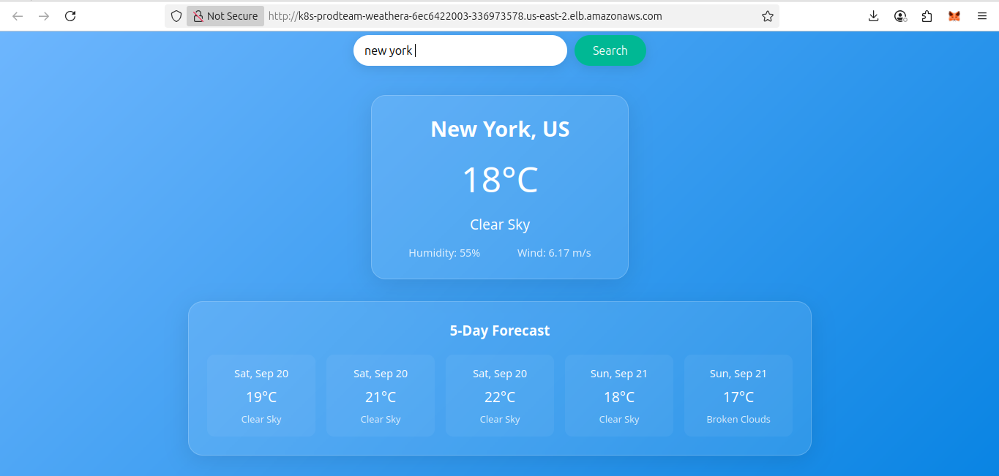
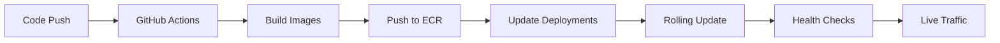

# Weather Microservices on AWS EKS

> A production-ready microservices application deployed on AWS EKS using Infrastructure as Code, demonstrating modern DevOps practices and cloud-native architecture.



## 🏗️ Architecture Overview
(./images/weather-forecast-architecture.drawio.png)

```
        
Supporting Services:
- VPC: Network isolation
- ECR: Container image storage  
- Secrets: API key management
```

## 🚀 Live Demo

**Application URL**: `http://k8s-prodteam-weathera-08f0979935-203385727.us-east-2.elb.amazonaws.com/`

**API Endpoints**:
- Health Check: `/api/health`
- Weather Data: `/api/weather?city=London`

## 📋 Table of Contents

- [Features](#features)
- [Tech Stack](#tech-stack)
- [Quick Start](#quick-start)
- [Project Structure](#project-structure)
- [Infrastructure](#infrastructure)
- [Deployment](#deployment)
- [API Documentation](#api-documentation)
- [Troubleshooting](#troubleshooting)
- [Lessons Learned](#lessons-learned)

## ✨ Features

- **Microservices Architecture**: Separate frontend and backend services
- **Infrastructure as Code**: Complete AWS infrastructure defined in Terraform
- **Container Orchestration**: Kubernetes deployment on AWS EKS with EC2 Node Groups
- **Auto-scaling Load Balancer**: AWS ALB with automatic target registration 
- **Service Discovery**: Kubernetes-native service mesh with ingress routing
- **Secure Secrets Management**: Kubernetes secrets for API key management
- **Health Monitoring**: Built-in health checks and monitoring endpoints
- **CI/CD Ready**: GitHub Actions workflow for automated deployments

## 🛠️ Tech Stack

### Infrastructure & DevOps
- **Cloud Provider**: Amazon Web Services (AWS)
- **Infrastructure as Code**: Terraform
- **Container Orchestration**: Kubernetes (Amazon EKS)
- **Compute**: AWS EKS with aws_eks_node_group
- **Load Balancing**: Application Load Balancer (ALB)
- **Container Registry**: Amazon ECR
- **CI/CD**: GitHub Actions

### Application Stack
- **Backend**: Node.js + Express.js
- **Frontend**: React.js + Create React App
- **Web Server**: Nginx (for serving React build)
- **External API**: OpenWeather API

### Development Tools
- **Package Management**: npm
- **Containerization**: Docker
- **Configuration**: YAML manifests
- **Version Control**: Git

## 🚀 Quick Start

### Prerequisites
```bash
# Required tools
- AWS CLI (configured with credentials)
- Terraform >= 1.0
- kubectl >= 1.21
- Helm >= 3.0
- Docker Desktop
```

### 1. Clone and Setup
```bash
git clone https://github.com/kelvin005/weather-forecast-microservice.git
cd weather-forecast-microservice
```

### 2. Deploy Infrastructure
```bash
cd terraform
terraform init
terraform apply -auto-approve
```

### 3. Configure Kubernetes
```bash
aws eks update-kubeconfig --region us-east-2 --name task-manager-eks
```

### 4. Install Load Balancer Controller
```bash
helm repo add eks https://aws.github.io/eks-charts
helm install aws-load-balancer-controller eks/aws-load-balancer-controller \
  -n kube-system \
  --set serviceAccount.create=true \
  --set serviceAccount.name=aws-load-balancer-controller \
  --set serviceAccount.annotations."eks\.amazonaws\.com/role-arn"=<CONTROLLER_ROLE_ARN> \
  --set clusterName=weather-forecast-microservice-eks \
  --set region=us-east-2
```

### 5. Deploy Applications
```bash
# Create secrets
kubectl create secret generic weather-secrets \
  --from-literal=OPENWEATHER_API_KEY=<YOUR_API_KEY> \
  -n prod-team

# Deploy applications
kubectl apply -f k8s/
```

### 6. Verify Deployment
```bash
kubectl get ingress -n prod-team
# Wait for ADDRESS field to appear, then test:
curl http://<ALB_ADDRESS>/api/health
```


## 🏗️ Infrastructure

### AWS Resources Created

| Resource Type | Name | Purpose |
|---------------|------|---------|
| VPC | `task-manager-vpc` | Network isolation |
| EKS Cluster | `task-manager-eks` | Kubernetes control plane |
| EKS Node Group | `task-manager-nodes` | EC2 worker nodes |
| ALB | `k8s-prodteam-weathera-*` | Load balancing |
| ECR Repository | `task-manager` | Container registry |
| IAM Roles | Multiple | Service permissions |

### Architecture Decisions

**Why EKS Managed Node Groups?**
- Simplified worker node management
- Automatic updates and patching
- Better integration with AWS services
- Cost optimization with On-Demand instances
- Enhanced monitoring and logging

**Why ALB over NLB?**
- Layer 7 routing capabilities
- Path-based routing for microservices
- Better integration with EKS ingress

**Why Kubernetes Secrets?**
- Native encryption at rest
- Automatic mounting to pods
- Better security than environment variables

## 🚀 Deployment

The application uses a multi-layer deployment strategy:

### 1. Infrastructure Layer (Terraform)
```hcl
# Creates foundational AWS resources
- VPC with public/private subnets
- EKS cluster with managed node group
- IAM roles and policies
- Security groups
- ECR for container repository
```

### 2. Platform Layer (Helm)
```yaml
# Installs Kubernetes controllers
- AWS Load Balancer Controller
- Ingress class configuration  
- RBAC permissions
```

### 3. Application Layer (kubectl)
```yaml
# Deploys microservices
- Backend: Node.js API server
- Frontend: Nginx web server
- Services: Internal load balancing
- Ingress: External access routing
```

### Deployment Flow



## 📚 API Documentation

### Backend Endpoints

| Method | Endpoint | Description | Response |
|--------|----------|-------------|----------|
| GET | `/api/health` | Service health check | `{"status":"OK"}` |
| GET | `/api/weather?city={city}` | Get weather data | Weather JSON object |

### Example API Calls

```bash
# Health check
curl http://<ALB_ADDRESS>/api/health

# Weather data
curl "http://<ALB_ADDRESS>/api/weather?city=London"

# Response format
{
  "city": "London",
  "temperature": "15°C",
  "description": "Partly cloudy",
  "humidity": "65%"
}
```

## 🔧 Troubleshooting

### Common Issues

#### 1. Pods Stuck in Pending State
```bash
# Check pod status
kubectl describe pod <pod-name> -n prod-team

# Common cause: Fargate profile not matching pod labels
# Solution: Update Fargate profile selectors
```

#### 2. Ingress Not Getting ALB Address
```bash
# Check controller logs
kubectl logs -n kube-system deployment/aws-load-balancer-controller

# Common cause: IAM permissions
# Solution: Verify controller role has CreateSecurityGroup permission
```

#### 3. 404 Errors from Application
```bash
# Check ingress routing rules
kubectl describe ingress -n prod-team

# Test backend directly
kubectl port-forward service/weather-backend-service 8080:8080
curl localhost:8080/api/health
```

### Debug Commands

```bash
# Cluster status
kubectl cluster-info
kubectl get nodes

# Application status  
kubectl get all -n prod-team
kubectl logs -n prod-team deployment/weather-backend

# Network debugging
kubectl get ingress,services,endpoints -n prod-team
kubectl describe ingress weather-app-ingress -n prod-team

# AWS resources
aws elbv2 describe-load-balancers --region us-east-2
aws elbv2 describe-target-health --target-group-arn <TG_ARN>
```

## 📖 Lessons Learned

### Technical Challenges Overcome

1. **EKS Node Group Scheduling**: Resolved complex node group configuration and security group setup for proper pod scheduling
2. **Service Discovery**: Debugged AWS Load Balancer Controller integration with kubernetes manager ALB 
3. **IAM Permissions**: Identified missing `ec2:CreateSecurityGroup` permission blocking ALB provisioning
4. **DNS Resolution**: Fixed CoreDNS scheduling issues that prevented controller API authentication
5. **Network Security**: Configured proper security group rules for ALB-to-Node communication

### Key Insights

- **Infrastructure as Code Complexity**: Managing both Terraform and Kubernetes resources requires careful coordination
- **Service Mesh Learning Curve**: EKS networking involves multiple layers (ALB → Ingress → Service → Pod)
- **Debugging Methodology**: Systematic troubleshooting from infrastructure → platform → application layers
- **Production-Ready Considerations**: Real-world deployments involve significantly more complexity than tutorials suggest

### Best Practices Developed

- Always verify IAM permissions early in the process
- Use proper node group sizing and security group configuration
- Implement comprehensive logging and monitoring from day one
- Test networking connectivity at each layer independently
- Document troubleshooting steps for future reference

## 🔐 Security

- Kubernetes secrets for sensitive data
- IAM roles with least-privilege access
- Private subnets for application workloads  
- Security group restrictions
- No hardcoded credentials in code

## 📊 Monitoring

```bash
# Application logs
kubectl logs -n prod-team deployment/weather-backend --tail=100

# Resource usage
kubectl top pods -n prod-team
kubectl top nodes

# Health endpoints
curl http://<ALB_ADDRESS>/api/health
```

## 💰 Cost Estimation

| Service | Cost Driver | Estimated Monthly |
|---------|-------------|------------------|
| EKS Control Plane | Fixed cost | $73 |
| EC2 Instances | t3.medium nodes | $30-60 |
| ALB | Load Balancer Units | $16-25 |
| ECR | Storage/Transfers | $2-5 |
| **Total** | | **~$121-163/month** |

## 🎯 Future Enhancements

- [ ] HTTPS/TLS termination with ACM
- [ ] Horizontal Pod Autoscaling (HPA)
- [ ] Cluster monitoring with Prometheus/Grafana
- [ ] Centralized logging with ELK stack
- [ ] Multi-environment support (dev/staging/prod)
- [ ] Database integration (RDS)
- [ ] API authentication and rate limiting
- [ ] Backup and disaster recovery

## 🤝 Contributing

1. Fork the repository
2. Create a feature branch (`git checkout -b feature/amazing-feature`)
3. Commit changes (`git commit -m 'Add amazing feature'`)
4. Push to branch (`git push origin feature/amazing-feature`)  
5. Open a Pull Request

## 📄 License

This project is licensed under the MIT License .

## 🙏 Acknowledgments

- AWS EKS documentation and best practices guides
- Kubernetes community troubleshooting resources
- OpenWeather API for weather data services
- The persistence required to debug complex cloud-native integrations

---

**⭐ If this project helped you learn about microservices and Kubernetes, please give it a star!**